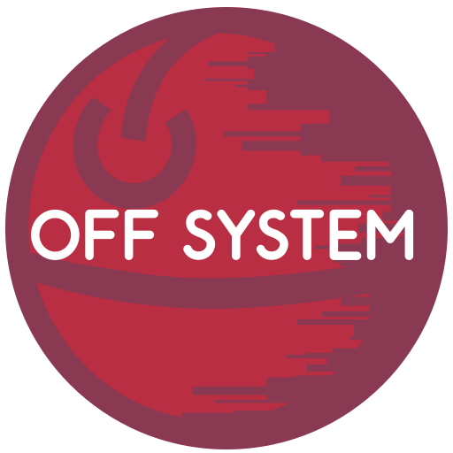

<p align="center">
  
</p>

# liboffs

A high-performance C library for the **Owner Free File System** — a decentralized,
content-addressed storage network. liboffs provides the core node implementation,
client/server APIs, P2P networking, and cross-platform abstractions needed to
build and interact with an OFFS network.

## Architecture

| Module | Purpose |
|--------|---------|
| `Actor` | Actor-based concurrency with message passing, thread pooling, and backpressure-aware scheduling |
| `BlockCache` | Content-addressed block storage with indexed sections, WAL, and cache eviction |
| `Bloom` | Attenuated, elastic, and standard bloom filters for probabilistic set membership |
| `Buffer` | Zero-copy memory buffer management |
| `ClientAPI` | Multi-transport client/server API: HTTP, TCP, Unix domain sockets, WebSocket, WebTransport — with auth middleware, block routes, and health checks |
| `ClientLibs` | C client library for connecting to OFFS nodes, plus OFD-aware recycler resolution |
| `Configuration` | Runtime configuration with validation for 12+ tunable network parameters |
| `Network` | P2P networking stack: gossip protocol, QUIC transport (MsQuic), TLS peer verification, NAT detection, ring topology, relay client/server, connection management |
| `Node` | Node lifecycle, graceful shutdown with phased draining |
| `OFFStreams` | Owner Free Format streams: readable/writeable descriptors, OFD cache, tuple management, block recipes |
| `Platform` | Cross-platform abstraction: threads, sockets, files, CSPRNG, monotonic clocks — POSIX and Win32 backends |
| `RefCounter` | Thread-safe atomic reference counting |
| `Scheduler` | Work-stealing actor scheduler with lock-free backpressure |
| `Timer` | Debounced and scheduled timer actors |
| `Util` | bcrypt, base58, CBOR validation, logging, hashing (BLAKE3) |

## Building

```bash
mkdir build && cd build
cmake .. -DCMAKE_BUILD_TYPE=Release
cmake --build . -j$(nproc)
```

Requires:
- CMake 3.16+
- C11/C++17 compiler
- OpenSSL 3.x
- MsQuic (optional, for QUIC/WebTransport)

## Tools

- **`offs-ca`** — Offline certificate authority for generating CA certs, node keys, and signing CSRs. Supports ed25519, RSA (2048/4096), and ECDSA (P-256/P-384/P-521).

## Example

```c
#include <offs_client.h>

int main(void) {
    offs_client_t *client = offs_client_create("localhost", 8080, false);
    offs_http_get(client, "/health", callback, NULL);
    offs_client_destroy(client);
}
```

See `examples/` for a Flutter client app and server example.

## Testing

```bash
cd build && cmake --build . --target testliboffs && ./test/testliboffs
```

## License

MIT
