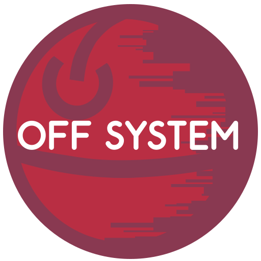

<p align="center">
  
</p>

# liboffs

A high-performance C library for the **Owner Free File System** — a decentralized,
content-addressed storage network. liboffs provides the core node implementation,
client/server APIs, P2P networking, and cross-platform abstractions needed to
build and interact with an OFFS network.

## Architecture

| Module | Purpose |
|--------|---------|
| `Actor` | Actor-based concurrency with message passing, thread pooling, and backpressure-aware scheduling |
| `BlockCache` | Content-addressed block storage with indexed sections, WAL, and cache eviction |
| `Bloom` | Attenuated, elastic, and standard bloom filters for probabilistic set membership |
| `Buffer` | Zero-copy memory buffer management |
| `ClientAPI` | Multi-transport client/server API: HTTP, TCP, Unix domain sockets, WebSocket, WebTransport — with auth middleware, block routes, and health checks |
| `ClientLibs` | C client library for connecting to OFFS nodes, plus OFD-aware recycler resolution |
| `Configuration` | Runtime configuration with validation for 12+ tunable network parameters |
| `Network` | P2P networking stack: gossip protocol, QUIC transport (MsQuic), TLS peer verification, NAT detection, ring topology, relay client/server, connection management |
| `Node` | Node lifecycle, graceful shutdown with phased draining |
| `OFFStreams` | Owner Free Format streams: readable/writeable descriptors, OFD cache, tuple management, block recipes |
| `Platform` | Cross-platform abstraction: threads, sockets, files, CSPRNG, monotonic clocks — POSIX and Win32 backends |
| `RefCounter` | Thread-safe atomic reference counting |
| `Scheduler` | Work-stealing actor scheduler with lock-free backpressure |
| `Timer` | Debounced and scheduled timer actors |
| `Util` | bcrypt, base58, CBOR validation, logging, hashing (BLAKE3) |

## Building

```bash
git clone --recurse-submodules https://github.com/Prometheus-SCN/liboffs.git
mkdir build && cd build
cmake .. -DCMAKE_BUILD_TYPE=Release
cmake --build . -j$(nproc)
```

### Windows (MSVC)

Helper scripts in `scripts/` drive an MSVC + vcpkg + Ninja build into
`cmake-build-msvc/`. They auto-locate `vcvars64.bat`, `VCPKG_ROOT`, and the
vcpkg toolchain (override via `VCVARS_ALL`, `VCPKG_ROOT`, `BUILD_DIR`, etc.).

```bat
:: One-time: install the OpenSSL 3.x dependency into vcpkg
scripts\vcpkg_install_openssl.bat

:: Configure (vcvars64 + vcpkg x64-windows-static-md toolchain, Ninja generator)
scripts\msvc_configure.bat

:: Build everything
scripts\msvc_build.bat
```

Per-target build scripts are also provided (`scripts\msvc_build_offs.bat`,
`msvc_build_offs_ca.bat`, `msvc_build_offs_relay.bat`,
`msvc_build_testliboffs.bat`, and per-test scripts).

QUIC/WebTransport is gated by the `OFFS_ENABLE_QUIC` CMake option (default
`ON`): with it on, a missing `deps/msquic` submodule is a configure-time error
rather than a silent degrade to stub networking; pass
`-DOFFS_ENABLE_QUIC=OFF` for an explicit client-only / no-P2P build.

Requires:
- CMake 3.16+
- C11/C++17 compiler
- OpenSSL 3.x
- MsQuic (optional, for QUIC/WebTransport; gated by `OFFS_ENABLE_QUIC`)

## Tools

- **`offs-ca`** — Offline certificate authority for generating CA certs, node keys, and signing CSRs. Supports ed25519, RSA (2048/4096), and ECDSA (P-256/P-384/P-521).
- **`offs-release-sign`** — Signs release manifests with an ed25519 private key so `offsd`'s self-update path can cryptographically verify release artifacts. See [docs/RELEASE.md](./docs/RELEASE.md) for the release-signing process.

## Self-update

`offsd` can self-update from releases published at `github.com/Prometheus-SCN/OFFS/releases`. The update path is cryptographically verified end-to-end:

- **TLS verification** — the updater verifies GitHub's TLS certificate against the system CA store (no unauthenticated connections).
- **Signed manifest** — each release carries a `manifest.cbor` + `manifest.cbor.sig`. The manifest lists every release file with its SHA256 and size; the signature is ed25519, verified against a release public key compiled into `offsd` at build time (`-DOFFS_RELEASE_PUBKEY=<path>`). **Fail-closed:** if the binary was built without `OFFS_RELEASE_PUBKEY`, self-update refuses to install anything.
- **Per-file SHA256** — every downloaded file is re-hashed and compared against the verified manifest. No opt-out: a file not in the manifest or a hash mismatch aborts the update.
- **Path-contained extraction** — archives are extracted by an in-process USTAR reader that rejects absolute paths, `..` components, symlinks, and hardlinks (no external `tar`, no path traversal).
- **Verified updater binary** — the staged `offs-updater` is itself a manifest-listed, hash-verified file; `offsd` execs the staged absolute path (not a `PATH` lookup).

The Prometheus-SCN release operator holds the signing private key offline; see [docs/RELEASE.md](./docs/RELEASE.md) for the key custody + per-release signing process.

## Operating a node

The `offsd` daemon and `offs` CLI are built from the `OFFS/` subtree. Start a
node with `offs start` (it double-forks and writes a PID file), stop with
`offs stop`, and query with `offs status` / `offs health`.

**TLS peer verification is off by default** (`allow_secure=false`): the
QUIC/WebTransport/relay paths then set
`QUIC_CREDENTIAL_FLAG_NO_CERTIFICATE_VALIDATION`, so connections are
encrypted but **not authenticated** — acceptable for a trusted LAN, not for
public-internet exposure. For production, set `allow_secure=true` in the
config and provision a CA with `offs-ca`; with a CA loaded, peer
certificates are validated against it on the direct-QUIC path.

Observability: logging is leveled per module (`log_level`, `log_structured`,
`log_module_levels`); `GET /health` returns node status, uptime, peer count,
topology, and the metrics registry as JSON. There is no Prometheus
exposition endpoint — scrape `/health` or the `offs-metrics` cJSON/CBOR
endpoints.

## Example

```c
#include <offs_client.h>
#include <stdio.h>

static void on_health(void* ctx, const char* json) {
    (void)ctx;
    printf("health: %s\n", json);
}

int main(void) {
    /* transport_url selects the transport: tcp://, ws://, wt://, http://... */
    offs_client_t* client = offs_client_connect("tcp://127.0.0.1:8080", NULL);
    if (client == NULL) {
        fprintf(stderr, "connect failed\n");
        return 1;
    }
    offs_client_health(client, on_health, NULL);
    offs_client_disconnect(client);
    return 0;
}
```

`offs_http_get(const char* url)` is a separate one-shot helper that opens a
raw TCP connection and returns the response body as a `buffer_t*` (caller
DESTROYs it); it does not take a client handle. See `examples/off_server/`
for a full server and `examples/off_client/` for a Flutter client app.

## Testing

```bash
cd build && cmake --build . --target testliboffs && ./test/testliboffs
```

On the MSVC build, the test binary is `cmake-build-msvc\testliboffs.exe`:

```bat
scripts\msvc_build_testliboffs.bat
cmake-build-msvc\testliboffs.exe
```

## License

MIT
